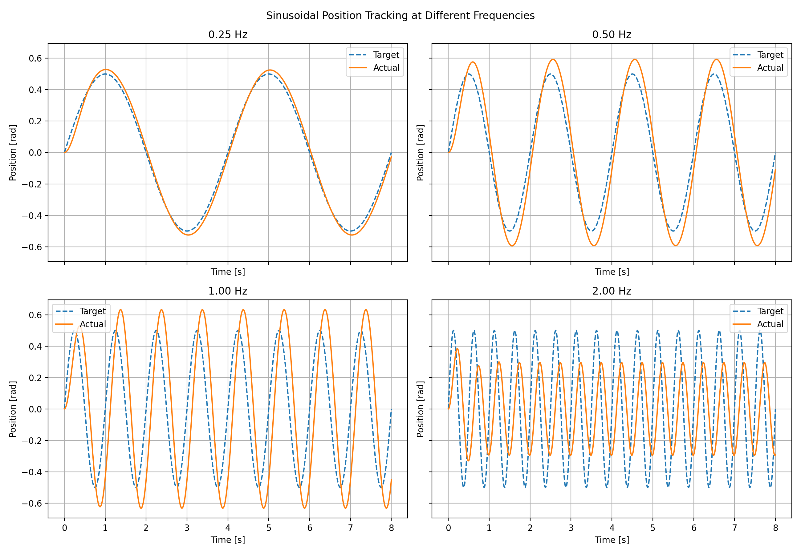
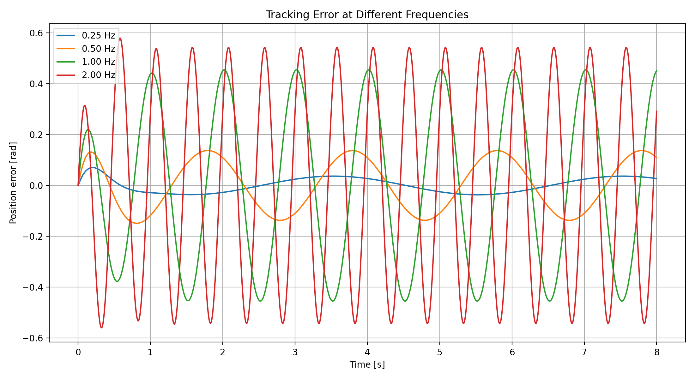
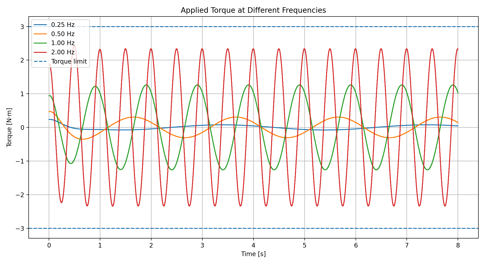

# LAB-1-PERIODIC-03：正弦轨迹跟踪实验总结

## 1. 实验目的

在单关节阶跃响应和延迟实验的基础上，本实验使用连续正弦目标轨迹，考察固定 PD 参数在不同运动频率下的跟踪误差、幅值响应、相位滞后、力矩需求和饱和情况。重点验证：同一组阶跃响应较好的参数并不一定能在任意频率下保持良好的轨迹跟踪性能。

## 2. 实验设置

关节模型和控制律分别为：

$$
J\ddot q+b\dot q=\tau,
\qquad
\tau=K_p(q_d-q)+K_d(\dot q_d-\dot q)
$$

正弦目标轨迹为：

$$
q_d(t)=A\sin(2\pi f t),
\qquad
\dot q_d(t)=2\pi fA\cos(2\pi f t)
$$

| 参数 | 数值 |
|---|---:|
| 转动惯量 $J$ | $0.05\ \mathrm{kg\cdot m^2}$ |
| 物理阻尼 $b$ | $0.05\ \mathrm{N\cdot m\cdot s/rad}$ |
| $K_p$ | 2.0 |
| $K_d$ | 0.3 |
| 轨迹幅值 $A$ | 0.5 rad |
| 测试频率 $f$ | 0.25、0.50、1.00、2.00 Hz |
| 控制频率 | 200 Hz |
| 物理仿真频率 | 1000 Hz |
| 仿真时长 | 8 s |
| 力矩限制 | $\pm3\ \mathrm{N\cdot m}$ |

仿真命令为：

```powershell
python -m sim.sinusoidal_tracking
```

程序会将每组完整时序数据保存到 `raw/`，将汇总指标写入 `summary.csv`，并生成三张对比图。指标计算跳过第一个周期，以减小启动瞬态的影响。实际振幅和相位通过正弦、余弦最小二乘拟合得到；幅值比定义为拟合振幅与 0.5 rad 指令振幅之比，正的相位滞后表示实际位置落后于目标位置。

## 3. 仿真结果

| 频率 | RMSE | 最大误差 | 拟合振幅 | 幅值比 | 相位滞后 | 最大力矩 | 饱和比例 |
|---:|---:|---:|---:|---:|---:|---:|---:|
| 0.25 Hz | 0.0260 rad | 0.0367 rad | 0.5254 rad | 1.0507 | 2.97° | 0.0768 N·m | 0.00% |
| 0.50 Hz | 0.0970 rad | 0.1372 rad | 0.5931 rad | 1.1862 | 10.62° | 0.3070 N·m | 0.00% |
| 1.00 Hz | 0.3213 rad | 0.4549 rad | 0.6319 rad | 1.2638 | 45.50° | 1.2624 N·m | 0.00% |
| 2.00 Hz | 0.3844 rad | 0.5799 rad | 0.2951 rad | 0.5901 | 81.89° | 2.4278 N·m | 0.00% |







## 4. 结果分析

### 4.1 低频跟踪

在 0.25 Hz 时，实际轨迹与目标轨迹基本重合，RMSE 仅为 0.0260 rad，相位滞后约 2.97°。这说明目标变化较慢时，控制器有足够时间修正位置和速度误差。幅值比略大于 1，表明闭环响应已有轻微增益放大，但尚不影响整体跟踪质量。

频率提高到 0.50 Hz 后，RMSE 增加到 0.0970 rad，幅值比增加到 1.1862，相位滞后增至 10.62°。系统仍能正确跟随目标周期，但实际振幅开始明显大于指令振幅。

### 4.2 中频增益峰值

在 1.00 Hz 时，拟合振幅达到 0.6319 rad，幅值比为 1.2638，是四组实验中最大的。与此同时，相位滞后达到 45.50°，RMSE 增至 0.3213 rad。该现象不是更好的跟踪，而是闭环系统在这一频段出现了明显的动态放大：输出幅值虽大，但位置已经不能与目标同步。

忽略力矩限幅和离散化时，闭环传递函数为：

$$
\frac{Q(s)}{Q_d(s)}=
\frac{K_d s+K_p}
{J s^2+(b+K_d)s+K_p}
$$

代入本实验参数后，连续模型在 0.25、0.50、1.00 和 2.00 Hz 处预测的幅值比分别约为 1.0508、1.1854、1.2496 和 0.5802，相位滞后约为 3.07°、10.89°、46.02° 和 81.22°。这些结果与离散仿真十分接近，说明曲线中的幅值放大和相位滞后主要来自闭环动力学，而不是绘图或指标计算误差。

### 4.3 高频衰减与力矩需求

在 2.00 Hz 时，幅值比降至 0.5901，实际关节只能达到约 59% 的目标振幅；相位滞后达到 81.89°，接近四分之一个周期。此时即使实际运动幅值减小，RMSE 仍达到 0.3844 rad，因为实际位置与目标位置严重不同步。

最大力矩随频率显著增加，从 0.25 Hz 的 0.0768 N·m 增加到 2.00 Hz 的 2.4278 N·m。四组实验均未达到 $\pm3$ N·m 限制，因此本轮性能下降并非由力矩饱和造成，而是由有限闭环带宽和相位滞后主导。不过 2.00 Hz 已使用约 80.9% 的力矩上限，若继续提高频率或轨迹幅值，预计很快会进入饱和区，跟踪误差也会进一步恶化。

## 5. 实验结论

1. 固定 $K_p=2.0$、$K_d=0.3$ 时，控制器能够较好跟踪 0.25 Hz 正弦轨迹。
2. 频率升高会同时增大跟踪误差、相位滞后和力矩需求。
3. 0.50–1.00 Hz 范围出现幅值放大，1.00 Hz 的幅值比达到 1.2638；输出更大不代表跟踪更准确，还必须结合 RMSE 和相位判断。
4. 2.00 Hz 时系统表现出明显的高频衰减，实际幅值只剩目标的约 59%，相位滞后接近 82°。
5. 所有工况均未发生力矩饱和，因此当前误差主要反映闭环带宽限制，而非执行器限幅。
6. 阶跃实验中较均衡的 PD 参数只保证特定时域响应，不能保证全频段轨迹跟踪。实际机器人应根据期望运动频率、允许误差和力矩余量共同选择增益。

## 6. 局限性与后续工作

当前模型仍未包含重力负载、库仑摩擦、齿隙、结构柔性、速度测量噪声、观测延迟和命令延迟。后续可在同一正弦扫描中加入延迟和噪声，比较不同 $K_p$、$K_d$ 的频率响应，并逐步使用 MuJoCo 或真实关节数据验证模型结论。对于 2.00 Hz 以上的实验，还应重点记录力矩饱和比例和饱和导致的谐波失真。
